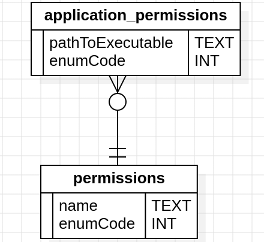

# DBUS PERMISSION SERVICE | C++
## Сборка :

### Необходимо для сборки
* clang ( Версия 12+ ) или gcc ( Версия 10+ )
* cmake
* ninja
* sdbus-cpp (2.0)

### Как собрать :
* Клонируем git репозиторий : `git clone https://github.com abstrakt-pbm/DBUS_PERMISSION_MANAGER.git`
* переходим в корень проекта `cd ./DBUS_PERMISSION_MANAGER `
* Создаём build файлы, в зависимости от того, собираем мы с llvm или gcc, вместо {?} подставляем linux_llvm или linux_gcc: ` cmake --preset {?} `
* Собираем проект, в зависимости от того, собираем мы с llvm или gcc, вместо {?} подставляем linux_llvm или linux_gcc: ` cmake --build --preset {?} `

### Запуск  :
После сборки в дирректории bin будут находятся 3 бинарника 
- com.system.permissions 
- com.system.time 
- application

#### Алгоритм запуска
* Переходим в дирректорию bin: `cd ./bin `
* В разных терминалах запускаем программы в следующем порядке:
    - Запускаем `./com.system.permissions`
    - Запускаем `./com.system.time`
    - Запускаем `./application`

## Описание Программ
### com.system.permission | Менеджер разрешений
**Представляет из себя DBUS сервис имеющий 2 метода**

* void RequestPermission(permissionEnumCode: int) : Выдаёт DBUS клиенту разрешение, соответствующее "permissionEnumCode"
* bool CheckApplicationHasPermission(applicationExecPath: String, permissionEnumCode: int): Позволяет клиенту узнать, имеет ли конкретное приложение какое-либо разрешение по его абсолютному пути

В случае если клиент запрашивает наличие разрешения с несуществующим permissionEnumCode, клиенту возвращается исключение с название "com.system.permission.InvalidArgument"

В случае если клиент запрашивает наличие у программы с пустым путём до файла определённое разрешение, возвращается исключение с именем "com.system.permission.InvalidArgument"

Сервис хранит разрешения для пользовательских программ, в sqlite3 базе данных c именем "permissions.db" и следующей структурой:

#### Примеры использования
* `gdbus call -e -d com.system.permissions -o /com/system/permissions -m com.system.permissions.RequestPermission 0`
* `gdbus call -e -d com.system.permissions -o /com/system/permissions -m com.system.permissions.CheckApplicationHasPermission /usr/bin/gdbus 0`

### com.system.time | Сервис системного времени
**Представляет из себя DBUS сервис имеющий 1 метод**
* uint64 GetSystemTime() : Возвращает клиенту, имеющему разрешение SystemTime(enumCode = 0), timestamp в секундах текущего системного времени, если у пользователя нет соответствующего разрешения, вызывается исключение с название "com.system.time.UnauthorisedAccess"

#### Примеры использование
* ` gdbus call -e -d com.system.time -o /com/system/time -m com.system.time.GetSystemTime `

### application | Клиент запращивющий время
**Приложение которое запрашивает у "com.system.time" текущее системное время, чтобы вывести его в человекочитаемом виде, в случае отказа, из-за отсутствия разрешения, запрашивает разрешение SystemTime у "com.system.permissions" и вновь запрашивает системное время**

## Что не успел реализовать
* Более подробный и информативные логи с разной глубиной логирования
* Асинхронную обработку входящих сообщений dbus серверами

## Что можно было бы добавить в будущем
* Разрешения дающиеся на определённое время
* Разрещения, которые снимаются с приложения если оно ими не пользуется длительное время
* Получение всех разрешений определённого приложения

**Весь проект отформатирован с помощью  clang-format в стиле Google**
